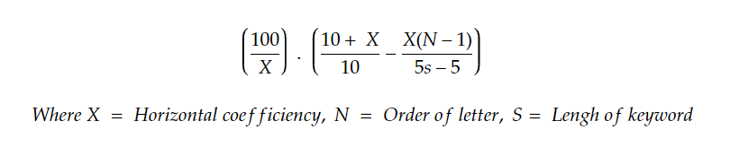
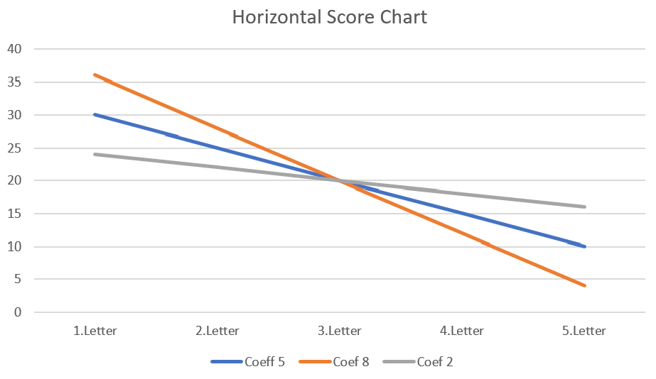

# product-keyword-score


## a. What assumptions did you make?

### Horizontal Effect

I assumed that the character order in a keyword is key factor to approximate the score. Each character's effect is not same in a keyword.The effect rate should be reduced as it gets closer to the end of the keyword.

For example "mouse", 5 characters, the score for each character should be, for example,  30, 25, 20, 15, 10 respectively, in total 100.

#### Means: When I type; <br/>


```http
m, mouse exists in succession list :  30 point,           
ma, mouse exists in succession list :  25 point,
   *
   *
mouse, mouse exists in succession list :  10 point.
Total 100. so the score 100.
```

The distributed rate should decrease linearly, but the problem is here, the linear decrease rate is not constant.
It varies according to some conditions like variety of possible product, product type, group, or sale season.

I defined a coefficient, `horizontalCoefficient`.   This is configurable field as configurable in application.properties.

###Formula

I built a formula to find a score by order of letter and length, `horizontalCoefficient` like below.




This number represents linear rate, defines whether line is reducing aggressively or smooth. It could get a number between 0 and 9.
```http
0 means, each letter has same effect. For example, for ipad, i:20, p:20, a:20, d:20. Total 100
9 means, make the gab between first letter effect and last letter effect high as much as possible, for example: for again ipad, i:47.5, p:32.5, a:17.49, d:2,5. Total 100
```



### Vertical Effect

`*hint: the order of the 10 returned keywords is comparatively insignificant!
`

Thats true, Index of keyword in the list has less effect, but we should reflect the order in total score.  `iphone 13 case` and `iphone 13 pro max case` are close each other, but they should have different score.   

So I  considered the order, but the problem here is same. How much should I reflect it ?  because of the same reason for  horizontal effect, depends on  product type, volume, group, or sale season.  

I made it configurable in application properties, named as `verticalCoefficient`
This argument gets a number between` 0 and 100 `, and defines power of the index value of keyword in succession list. 

```http
0 , there no effect of index value, 
100 ,  max effect. 
```

#### Example for "iphone charger" 
Request

`curl --location --request GET 'http://localhost:8080/estimate?keyword=iphone charger'`

`horizontalCoefficient = 6
verticalCoefficient = 10`

       :  Prefix:i,              horizontalScore: 10.285714, verticalScore: 0.045714304, total:10.33
	   :  Prefix:ip,             horizontalScore: 9.692307,  verticalScore: 0.05384617,  total:9.75
       :  Prefix:iph,            horizontalScore: 9.098901,  verticalScore: 0.060659353, total:9.16
	   :  Prefix:ipho,           horizontalScore: 8.505495,  verticalScore: 0.056703303, total:8.56
	   :  Prefix:iphon,          horizontalScore: 7.912088,  verticalScore: 0.052747283, total:7.96
       :  Prefix:iphone,         horizontalScore: 7.3186817, verticalScore: 0.048791204, total:7.37
       :  Prefix:iphone ,        horizontalScore: 6.725274,  verticalScore: 0.044835176, total:6.77
       :  Prefix:iphone c,       horizontalScore: 6.131868,  verticalScore: 0.06813188,  total:6.20
       :  Prefix:iphone ch,      horizontalScore: 5.5384617, verticalScore: 0.061538458, total:5.60
	   :  Prefix:iphone cha,     horizontalScore: 4.945055,  verticalScore: 0.05494504,  total:5.00
	   :  Prefix:iphone char,    horizontalScore: 4.3516483, verticalScore: 0.04835167,  total:4.40
       :  Prefix:iphone charg,   horizontalScore: 3.7582412, verticalScore: 0.04175825,  total:3.80
       :  Prefix:iphone charge,  horizontalScore: 3.164835,  verticalScore: 0.035164833, total:3.20
       :  Prefix:iphone charger, horizontalScore: 2.5714285, verticalScore: 0.028571416, total:2.60

       :  Overall score for iphone charger : 90.70


## b. How does your algorithm work?

1-) When the request comes, i divide word into prefix combinations, Ex. ipad -> i, ip, ipa, ipad. <br/>
2-) Each prefix is assigned to a `CompletableFuture` task. I'm doing that because of time concern. Every thread works in parallel, asynchronously, they are non-blocking. 
Every thead waits each other until all of them finish their job. <br/>
3-) The task starts with getting succession from Amazon api by keyword. <br/>
4-) Calculation of horizontal score with the formula above.  <br/>
5-) Calculation of vertical score with vertical coefficient. <br/>
6-) Combining all `CompletableFuture`, and summing results, sending in `EstimationResponse`.<br/>

I added circuit breaker, when the response time exceeds 10s, or occurs and exception, a meaningful response is sent to client.   

## c. Do you think the (*hint) that we gave you earlier is correct and if so - why?
In total, it has less effect, but it should be reflected. We can configure the efficiency with  `verticalCoefficient`


## d. How precise do you think your outcome is and why?

The results may not be consisted, because there are millions products, thousands product type and brand. Every keyword has different density rate.  
When I write "i", all succession item is Apple products, most of them are Iphone gadgets. But when I write "s", there is no Samsung product, for "sa" only one Samsung item. But these 2 brands have similar market share in US market. 
Although, "i" is determinative prefix for Apple, "sam" 3 letters, is s determinative prefix for Samsung. 

Every keyword should be assessed in a specific product type, or brand.
I think defining the coefficient dynamically is the matter. Currently, I'm calculating scores for each prefix with a static coefficient, but it could be defined with different parameters. 


